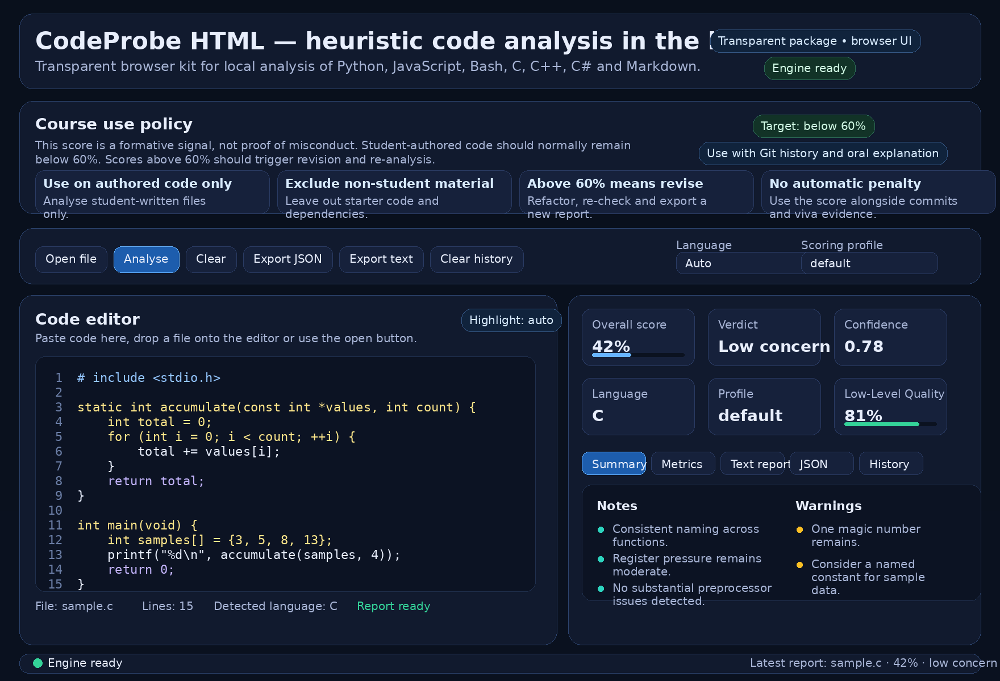

# CodeProbe v2.2.0 — naming-stable local code-review kit



CodeProbe is a local, browser-based static-analysis kit for formative review of student-authored source code. It runs through Pyodide, keeps the auditable Python runtime in `src/codeprobe_runtime.py`, and avoids opaque bundled execution formats.

Version `2.2.0` is the **naming-stable release**. The documentation, educator resources, calibration templates, browser app, runtime, command-line tools, tests and release-evidence files now use short, representative paths. Start with `00-kit-index.md` when you need to locate a resource quickly.

## What this kit is for

Use CodeProbe to help students inspect authored source files before submission. The kit reports structural, stylometric and code-quality signals that may justify revision or discussion.

The reported **AI-style concern score** is a review signal; it is not proof of misconduct, not a formal authorship attribution and not a certificate of independent authorship. Where a manual review is needed, the score should be read with repository history, intermediate commits, design notes, tests and an oral code walkthrough.

The browser interface accepts direct drag-and-drop: a single source file opens single-file analysis; a folder, multiple files or a GitHub ZIP export opens project mode. Project mode applies built-in exclusions, any `.codeprobeignore` file found in the project and the structured manual-review guidance that appears in exported reports. When a ZIP contains a single hosted-export wrapper such as `repository-main/`, CodeProbe strips that wrapper before evaluating `.codeprobeignore`; the report records this in `input_packaging`.

## Repository layout

The active file inventory is `docs/00-file-catalogue.md`, the naming rules are `docs/01-naming-policy.md` and the migration record is `release/file-rename-map.csv`.

```text
.
├── 00-kit-index.md
├── README.md, CHANGELOG.md, CONTRIBUTING.md, LICENSE
├── .codeprobeignore.example, .gitattributes, .gitignore
├── .github/      least-privilege continuous-integration workflow
├── app/          browser interface, CSS/JS assets, runtime config and Pyodide vendor placeholder
├── src/          browser-compatible runtime and maintainer support package
├── tools/        CLI analysis, calibration, local server, release and audit tools
├── docs/         numbered technical documentation, assets and chronological history
├── educator/     student and instructor resources
├── calibration/  corpus manifests, profile templates and validation-report placeholders
├── release/      release manifest, file rename map and final audit evidence
└── tests/        behaviour-focused regression tests
```

## Course use policy

A defensible use model is:

1. students analyse only the source files they authored for the assessed task;
2. starter code, third-party libraries, generated files, minified assets, build output and documentation are excluded;
3. the bundled **60% trigger is provisional** and should be replaced by a course-local calibration profile when possible;
4. a result above the active review trigger should normally lead to revision, disclosure where required and human review if concern persists;
5. no academic penalty should be based on the CodeProbe score alone.

### Suggested provisional interpretation bands

| AI-style concern score | Recommended reading | Expected action |
|---:|---|---|
| 0-50% | Low concern | Proceed normally, while keeping normal evidence of authorship |
| >50-60% | Borderline | Review comments, naming, repetition and structure; re-run if revised |
| >60-75% | Elevated concern under the bundled policy | Revise, re-run and attach a brief disclosure if required |
| >75% | High concern | Manual review with commits, tests, design notes and oral explanation |
| N/A | Not applicable | Usually Markdown or too little code; read metric details only |

A calibration profile may alter the local review trigger and displayed band thresholds. Reports include `review_trigger`, `review_trigger_percent`, `review_triggered`, `calibration_profile_id` and the active review policy. Release metadata such as `generated_at_utc`, `engine_fingerprint`, `metric_config_digest`, `metric_role_summary` and `tool_metadata` supports later audit and reproduction.

Markdown files are analysed only as documentation-quality context in single-file mode. In project mode, documentation is excluded by default so the aggregate remains focused on assessed source code.

## System requirements

| Component | Requirement |
|---|---|
| Browser | Modern Chromium, Firefox or Safari-class browser |
| Network | Internet access to the configured Pyodide CDN, or a local Pyodide copy configured in `app/runtime-config.json` |
| Python | 3.10–3.14 for the command-line tools, calibration and tests; optional for browser-only use |
| Node.js | 24.20.0 in CI; used only to syntax-check the browser scripts |

No build step is required.

## Browser security and privacy

Browser JavaScript and CSS are external resources. The HTML pages use a Content Security Policy without `unsafe-inline`; local CodeProbe browser assets carry SRI attributes and `app/resource-integrity.json` records their SHA-256 values.

Pyodide loading is controlled by `app/runtime-config.json`. The default mode uses the CDN so the kit works immediately. A local institutional deployment also needs a complete authenticated runtime inventory before it can pass the canonical release gate; hashing `pyodide.js` alone is insufficient. See `docs/04-browser-security.md` and `docs/05-offline-deployment.md`.

The committed CI workflow validates Python 3.10–3.14, requires Node.js for
JavaScript syntax checking and compares normalised checkouts, an exact Git
archive and the complete three-file release packet. Its least-privilege design,
immutable action pins and required repository settings are recorded in
`docs/16-ci-and-repository-controls.md`.

Browser report history is disabled by default. It stores reports, not source code, when explicitly enabled. The main interface includes **Clear privacy data**, which clears local report history, disables history and clears the current editor/project payload from the page state.

## Launch instructions

### Windows

```powershell
py -3 tools/run_local_server.py
```

or:

```powershell
python tools/run_local_server.py
```

Open the printed local address, usually similar to `http://127.0.0.1:8123/app/index.html`. The dedicated project page is available at `http://127.0.0.1:8123/app/project.html`.

### Linux and macOS

```bash
python3 tools/run_local_server.py
```

Then open the printed local address.

## Browser use

- Paste a single source file into `app/index.html`, or drag a file onto the page.
- Drag a folder, multiple files or a GitHub ZIP export onto the page to open project mode.
- Use `.codeprobeignore` in a project to exclude generated, third-party or non-assessed material.
- Export JSON/text and keep the included/excluded file lists with the submission evidence.
- Use the **Review plan** output to decide what requires manual explanation or inspection.

## Command-line use

Project analysis:

```bash
python3 -I -S -B tools/analyze_project.py --folder path/to/project --json-out report.json --text-out report.txt
```

ZIP analysis:

```bash
python3 -I -S -B tools/analyze_project.py --zip path/to/project.zip --json-out report.json --text-out report.txt
```

Calibration from a manifest:

```bash
python3 -I -S -B tools/calibrate_profile.py   --manifest calibration/01-corpus-manifest-template.csv   --profile-id intro-python-2026-v1   --label "Intro Python 2026"   --target-fpr 10   --profile-out calibration/profiles/intro-python-2026.json
```

## Release validation

Run the full validation pipeline from the repository root:

```bash
python3 -I -S -B tools/check_release.py
```

This canonical gate is read-only. Its first check rejects symbolic links and
special files in the release set, then it verifies the committed audit reports
and the complete manifest metadata, membership, sizes and hashes without
replacing them. After an intentional source change, refresh those evidence files
only after the remaining checks pass:

```bash
python3 -I -S -B tools/check_release.py --write-release-evidence
```

The former `--write-manifest` spelling remains a compatibility alias.

Build the manifest-verified three-file release packet:

```bash
python3 -I -S -B tools/build_release.py --out dist/CodeProbe_Project_Kit_v2.2.0.zip
```

The builder verifies the committed evidence without rewriting tracked source
evidence. It captures immutable bytes for every manifest-listed regular file and
for the verified manifest itself, then packages them under the stable
`CodeProbe_Project_Kit_v2.2.0/` archive root. The ZIP, its required SHA-256
sidecar and its required `.package_audit.json` member-accounting sidecar are
staged and verified before their public paths are replaced. A detected publication failure attempts
to restore the prior three-file packet and reports an incomplete rollback. See
`docs/08-release-process.md` for the crash and filesystem guarantee boundary.

## Final naming-stable audit

`docs/15-final-release-audit.md` records the final naming boundary and the validation checks that must pass before institutional distribution. Future features should extend the current directories rather than reintroducing duplicate active paths or long historical filenames.

## Included companion documents

| File | Purpose |
|---|---|
| `00-kit-index.md` | Fast navigation through the complete package |
| `docs/00-file-catalogue.md` | Current file inventory and migration record summary |
| `docs/01-naming-policy.md` | Naming rules for future changes |
| `docs/15-final-release-audit.md` | Final release boundary and validation audit |
| `educator/01-student-quick-start.md` | One-page student procedure |
| `educator/07-course-integration.md` | Instructor-facing policy, evidence model and calibration workflow |
| `educator/05-review-protocol.md` | Manual review procedure for triggered reports |
| `educator/06-evidence-rubric.md` | Evidence rubric for human review |
| `calibration/README.md` | Course-local corpus and calibration instructions |
| `.codeprobeignore.example` | Project-mode exclusion template; parsed automatically when copied to `.codeprobeignore` |

## Limitations

- The score is heuristic and remains provisional until a local course corpus is built.
- A local calibration profile is only as reliable as its labelled samples.
- Small files, heavily templated assignments and generated scaffolds can distort readings.
- A low score does not prove independent work.
- A high score does not prove misconduct.
- Static analysis cannot reconstruct the development process; commits, tests and explanation remain essential.
- Markdown support is intentionally separated from the AI-style code aggregate.
